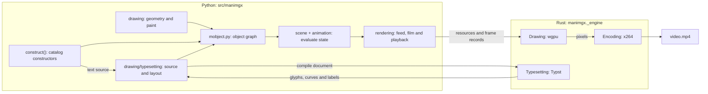

# Understanding manimgx

This page follows a scene from its code to its video: what each step does, why it is built
the way it is, and where its code lives.

## How the package is organized

There are three different things to follow: constructing objects, changing their
state over time, and producing output. `mobjects/` is the catalog of constructors;
`mobject.py` is the shared mutable object model they use. Objects hold immutable
geometry and paint from `drawing/`. `scene.py` and `animation/` evaluate the object
graph, then `rendering/` turns its state into native records, films and playback.

| Responsibility | Implementation |
| --- | --- |
| Object identity, families, copying, layout, updaters and trackers; path, point-cloud and mesh rules | `mobject.py` |
| Authored shapes, plots, graphs, grids, text, images and other constructors | `mobjects/` |
| Geometry algorithms, immutable shapes, affine blends and motion paths | `drawing/geometry.py` |
| Color parsing and interpolation, immutable brushes and appearance | `drawing/paint.py` |
| Source and font environment to owned Typst layout | `drawing/typesetting.py` |
| Scene lifecycle, membership and camera state, including the specialized scenes | `scene.py` |
| Animation windows, transforms, presets, matching, updaters, easing and the exact clock | `animation/` |
| Native draw records, output sessions and the playback window | `rendering/feed.py`, `rendering/film.py`, `rendering/window.py` |
| Sound and speech values, word timing and voice providers | `audio/sound.py`, `audio/fal.py` |
| Scene loading, export, preview, diagnostics and storyboards | `cli/` |

These boundaries follow ownership. A drawing value has no mutable object family;
many objects can hold the same shape. A catalog constructor builds those objects
but does not own the scene clock. The scene evaluates them; the output layer reads
their evaluated values. Typesetting belongs with drawing data because a layout
contains glyphs, placements and labels, before any scene objects are built.

Configuration and frame-relative units live in `config.py`; shared authoring
constants and type aliases in `constants.py` and `typing.py`. `caches.py` supplies
the reuse and invalidation policy. Each algorithm keeps its own cached values.
The font distributions remain separate Python packages. The browser presentation
template lives beside its exporter in `cli/present.html`.

The top-level `manimgx` module exports the authoring API, and scenes import from it
alone: CE's module paths, such as `manim.utils.paths`, have no counterpart. The corpus
runs the same scenes on CE by finding those names where CE keeps them
(`tests/integration/corpus/run_ce.py`). Implementation code imports the owning module
directly.

## The core workflow

A scene passes through construction, evaluation and output:



The scene's code describes what happens. Constructors build mobjects whose current
state refers to drawing values; animations and updaters change that state. The clock
decides which instant a frame shows. The feed translates the evaluated state into
native drawing records, and the film directs the output. Python decides what a
frame shows; Rust draws its pixels and encodes the video.

This page follows this scene:

```python
import manimgx as m


class UnderstandingManimgx(m.Scene):
    def construct(self) -> None:
        square = m.Square(side_length=3, color=m.BLUE, fill_opacity=0.5)
        label = m.MathTex(r"A = s^2", font_size=64).next_to(square, m.UP)
        self.play(m.Create(square), m.Write(label))
        self.play(square.animate.rotate(m.PI / 4))
```

## Step 1: The scene runs its code

`manimgx render scene.py` loads the file, picks the scene and calls
[`Scene.render`][manimgx.Scene.render]. `render` makes a new [`Film`][manimgx.Film], calls
`setup`, `construct` and `tear_down`, records a closing frame, and closes the film.

`construct` is ordinary Python, run once from top to bottom. The API it calls is Manim
Community Edition's: the same classes, methods and parameters. CE's behavior does not come
with it: what a scene means (its timing, its geometry, how it looks) is decided on its own
merits, so "Manim CE does it this way" is a reason to look closely, not a reason to change
manimgx. What the calls do is manimgx's own design, described below.

A [`Scene`][manimgx.Scene] holds three things: the mobjects it draws, a camera, and a clock.
Time passes only in [`play`][manimgx.Scene.play] and [`wait`][manimgx.Scene.wait]; everything
between two of them happens at one instant. The camera is made of mobjects (a frame
rectangle, value trackers for the 3D orbit), so animations and updaters move it as they
move anything else.

See [`scene.py`](https://github.com/academa-labs/manimgx/blob/main/src/manimgx/scene.py),
which owns the camera and scene variants as well as their shared execution model.

## Step 2: Mobjects

A mobject is what you see: the square and the formula above. It is a node of an object graph
(a [`VGroup`][manimgx.VGroup] holds others, and groups may share children) with points,
a style, updaters and a z-index.

### Geometry as a blend of shapes

Geometry is independent of the object that holds it: a mobject's points are a *blend* of immutable shapes,
points = Σₖ Mₖ·Sₖ. A shape Sₖ is an array of control points that never changes, identified
by its content. A matrix Mₖ is an affine map. Moving, scaling or turning a mobject composes
a matrix and leaves the shape alone; a morph from one shape to another is a blend of two
terms. Reading `points` computes the sum, and caches it. The engine receives the terms,
not the sum: turning the square sends one new matrix, not new points. Assigning a
mobject the points it has changes nothing (so does assigning a mesh its triangles, or a
paint its colors): it keeps what it holds, and all that was derived from it.

See [`drawing/geometry.py`](https://github.com/academa-labs/manimgx/blob/main/src/manimgx/drawing/geometry.py).
It also owns numeric sampling and cubic-outline conversion. Text clipping and Boolean
shapes use the same planar paths; `VMobject` owns building mutable curves from the result.

### Paint

A mobject's style is one immutable value, its `Paint`: its fill and stroke (a color each,
or several), its background stroke, its caps and joints, its dashes, and the part of it
that is revealed. A change makes a new paint. Every kind of mobject shares it; a kind
decides what several colors mean: gradient stops on a path, point or vertex colors,
or fill colors per lattice cell.

See [`drawing/paint.py`](https://github.com/academa-labs/manimgx/blob/main/src/manimgx/drawing/paint.py).

### Three kinds

[`Mobject`][manimgx.Mobject] implements, once, what every mobject does: transforms, bounds,
layout, style, interpolation. A kind overrides only how it is bounded, aligned with another
of its kind, and cut into parts:

- [`VMobject`][manimgx.VMobject]: paths of cubic Bézier curves, four control points each.
  The square is one.
- [`PMobject`][manimgx.PMobject]: point clouds.
- [`MeshMobject`][manimgx.MeshMobject]: vertices and triangles, colored per vertex or by a
  texture. Its topology is one immutable value: explicit triangle indices, or the
  dimensions of a sampled lattice. An [`ImageMobject`][manimgx.ImageMobject] is a textured
  quad; a [`Surface`][manimgx.Surface] samples a lattice once, with paint per cell and UVs
  per sample. Rendering derives its smooth spline, cell outlines and vertex colors.
  Equal lattices morph directly; different topology aligns as independent triangles.

All three kinds live in
[`mobject.py`](https://github.com/academa-labs/manimgx/blob/main/src/manimgx/mobject.py).
They share object identity, copying, family operations and lifecycle; their classes
keep the different rules for path curves, point colors and mesh topology explicit.

The [`mobjects/`](https://github.com/academa-labs/manimgx/tree/main/src/manimgx/mobjects)
catalog builds concrete drawings on those rules. `shapes.py` constructs figures,
curve decompositions, dashed paths and Boolean regions; `annotations.py` places labels,
frames and braces around objects;
`plotting.py` owns coordinate models and plotted data. `grid.py` groups the shared
entry model for matrices and tables, retaining their distinct layouts. Images,
graphs, surfaces, vector fields and text likewise have their own constructors.
Catalog code uses the kernel; the kernel does not import the catalog wholesale.

### Text: source, layout, and drawing

The formula is typeset by [Typst](https://typst.app), compiled into the engine: in the same
process, with no TeX installation. Typesetting constructs ordinary path mobjects; their
geometry, paint, animation, and rendering then work like the square's.

1. **Source.** [`mobjects/text.py`](https://github.com/academa-labs/manimgx/blob/main/src/manimgx/mobjects/text.py)
   holds the source frontends and their common builder. [`Typst`][manimgx.Typst] takes
   Typst markup; [`MathTypst`][manimgx.MathTypst] adds mathematical grouping;
   [`Text`][manimgx.Text] writes literal strings and typography runs;
   [`MathTex`][manimgx.MathTex] and [`Tex`][manimgx.Tex] convert LaTeX through the engine's
   [mitex](https://github.com/mitex-rs/mitex) converter. Each reaches the same typesetter.
2. **Layout.** [`drawing/typesetting.py`](https://github.com/academa-labs/manimgx/blob/main/src/manimgx/drawing/typesetting.py)
   combines the source with its preamble, fonts, and package environment. The engine
   typesets the document and reads Typst's frames: glyph placements, paint, source
   byte ranges, cubic shapes, and labeled groups. Python keeps the drawable rows
   and the immutable outlines and ligature carets they refer to. This is drawing data;
   it contains no scene objects.
3. **Mobjects.** The common Typst builder places each glyph as a blend of its immutable
   outline and a matrix, gives each part its paint, and creates groups referring to
   the actual parts. Literal text associates glyphs with characters; LaTeX associates
   them with selectable formula pieces. Changing a character's color can split a
   ligature at its carets without changing the typeset layout.

Layouts and font scans use the current user's cache directory, or the page runtime's
private filesystem in the browser. Layouts are keyed by source and environment. Decoded
glyph records are reused in a bounded cache, while layouts and live glyphs hold what they need themselves. Clearing that cache does
not invalidate existing text. `MANIMGX_CACHE_DIR` relocates both disk caches to an explicit
directory, useful in containers and isolated tests. The fonts come from the caller's paths,
the installed manimgx font packages, and Typst's embedded fonts; a system font is considered
only for a family the document explicitly names. See [The engine](engine.md#typesetting) for
the native compiler and font environment.

Two consumers have their own layout responsibilities.
[`mobjects/code.py`](https://github.com/academa-labs/manimgx/blob/main/src/manimgx/mobjects/code.py)
builds syntax-colored listings with a line and column grid, line numbers, and a frame.
[`mobjects/numbers.py`](https://github.com/academa-labs/manimgx/blob/main/src/manimgx/mobjects/numbers.py)
formats and lays out number rows that can change during an animation. Both use the
typeset mobjects rather than another text renderer.

SVG takes a separate input route.
[`mobjects/svg.py`](https://github.com/academa-labs/manimgx/blob/main/src/manimgx/mobjects/svg.py)
reads an external vector drawing, converts its shapes and paths, applies its paint and
transforms, and preserves its id groups. It reaches the same geometry and paint model
without passing through the typesetter.

## Step 3: Animations

Animations describe changes to the object graph. Their timing and their geometric
composition have separate owners: a window says when an animation acts, while a
transform says how it changes an object. Animation classes are built on two primitives.

- A **tween**, [`Transform`][manimgx.Transform]: it moves each leaf of its mobject between
  keyframes, along a path. Most classes are presets of keyframes, path and flags. A reveal
  is paint (the revealed part of a path), so [`Create`][manimgx.Create] is a tween too.
- A **procedure**, [`Animation`][manimgx.Animation]: its progress α, from 0 to 1, drives
  code that changes the mobject.

On top of them:

- [`.animate`][manimgx.Mobject.animate] records method calls. When its animation begins, it
  carries them out on the mobject as it is then, and tweens to the result.
- [`AnimationGroup`][manimgx.AnimationGroup], [`LaggedStart`][manimgx.LaggedStart] and
  [`Succession`][manimgx.Succession] are one class. A group gives each part a window of its
  own time, and a part's α is a function of that time alone, so a group can be evaluated at
  any number of instants at once.
- Tweens that begin together on one leaf compose: its motion chains all of theirs, and
  each paint field is the last changer's.

See [`animation/`](https://github.com/academa-labs/manimgx/tree/main/src/manimgx/animation):
[`timeline.py`](https://github.com/academa-labs/manimgx/blob/main/src/manimgx/animation/timeline.py)
owns lifecycle and nested time windows;
[`transform.py`](https://github.com/academa-labs/manimgx/blob/main/src/manimgx/animation/transform.py)
owns keyframe evaluation, recorded method calls and concurrent leaf composition;
[`motion.py`](https://github.com/academa-labs/manimgx/blob/main/src/manimgx/animation/motion.py)
builds the animation presets on them. Timing composition and geometric composition
have separate owners because they answer different questions: when a part acts, and
how its contribution combines with the other transforms acting on the same object.

## Step 4: The clock

If time is a float that each frame advances by 1/fps, errors accumulate,
a play's length is rounded to whole frames, and a physics updater given `dt = 1/fps`
behaves differently at 30 and at 60 frames per second. What a scene shows would depend on
its frame rate.

Scene time is exact, a `Fraction` of seconds, and frames sample it.
Floating durations, lag ratios and frame rates mean the simplest rational that rounds
back to the supplied float: `5 / 6` stays exactly five sixths, while distinct floats stay
distinct and a positive duration never rounds down to zero. Compositions keep their
computed durations as fractions; observation and animation evaluation use floats.

- A play or wait of duration _d_ that begins at time _T_ owns the frames whose observed
  times fall in [_T_, _T_ + _d_). Frame _k_ samples _k_/fps. An event and a sample that
  round to the same binary64 instant are observed together: the frame sees every event
  there, in exact order, without rewinding the last event. This applies to nested
  animations as well as successive plays: rounding differences that leave an observed
  instant unchanged do not add a frame. Still exports select from this same sample grid.
- Then the world is brought to _T_ + _d_ itself, where `construct` goes on.
- When `construct` returns, a closing frame shows the scene as it ends.

At each instant, the playing animation is evaluated at its point in its window of time,
then the updaters run, then the recorders (such as a [`TracedPath`][manimgx.TracedPath]).
A per-frame updater restores a relation. A time-based updater that is a *flow* is exact at
any instant; any other time-based updater is *simulated*, stepped on a clock of its own
(`config.simulation_rate` ticks a second, 60 by default), independently of the output frame
rate. A per-frame callback that accumulates a change on each invocation still depends on
how many frames are requested; express such motion in time or as a restored relation.

The frames of a play are computed in one of two ways:

- **One instant at a time**, in general: the play's step, then the updaters, for each frame.
- **All at once**, for a play that is a pure function of time: tweens between fixed
  keyframes, in a scene with no updaters. Its frames are computed together, as arrays.

A wait in which nothing can change is one frame, held.

See [`animation/clock.py`](https://github.com/academa-labs/manimgx/blob/main/src/manimgx/animation/clock.py) and,
in [`scene.py`](https://github.com/academa-labs/manimgx/blob/main/src/manimgx/scene.py),
`play`, `_run` and `_instant`. The User Guide's
[The basics](../user-guide/the-basics.md#one-step-after-another) describes the clock as a
scene's author sees it.

## Step 5: The film and its feed

The renderer consumes drawing values rather than the Python object graph. A frame
is described to the engine as a *view* (the camera's matrices and the background) and one 336-byte *record* per object: its two shape keys and
two 3×4 matrices (the blend's terms), its reveal window, its colors, its gradient or
per-vertex color rows (by key), its widths and flags. Shapes, color rows and textures are
uploaded once, keyed by their content and interpretation (an xxh3 digest). Equal shapes
of the same kind share GPU memory; a path and a point cloud with the same coordinates
remain separate resources. What no frame has shown for a while is freed.

The [`Film`][manimgx.Film] sends each frame:

- to the video, encoded as it comes;
- to a function, if one is given, as a [`Frame`][manimgx.rendering.film.Frame] that draws its pixels
  only when asked;
- or without per-frame output: `manimgx inspect` evaluates the timeline and draws only
  selected storyboard snapshots.

A frame equal to the one before is not sent again: it lengthens it, into a hold. Each play,
as it ends, is kept as a [`Play`][manimgx.rendering.film.Play]: its exact start and end, and the line
of the scene's code that played it.

See [`rendering/film.py`](https://github.com/academa-labs/manimgx/blob/main/src/manimgx/rendering/film.py) and
[`rendering/feed.py`](https://github.com/academa-labs/manimgx/blob/main/src/manimgx/rendering/feed.py).

Sound follows the same scene timeline. `audio/sound.py` owns [`Sound`][manimgx.Sound]
and [`Speech`][manimgx.Speech], their edits and word times. The scene schedules clips
and captions; the film carries them into its output. Voice-provider code is separate
in `audio/fal.py`, while any function returning a Speech can be a voice.

## Step 6: The engine

The engine is a Rust crate compiled into the package as `manimgx._engine`. It draws the
records on the GPU with [wgpu](https://wgpu.rs): paths use analytic segment coverage after
curve flattening, while point clouds and meshes use a raster pipeline. The view's
composite combines their coverage, paint, and depth. For a video, it converts only the
parts of a frame that changed, hands them to x264 on a thread of its own, and writes the
MP4. It also typesets.

[The engine](engine.md) describes it.

## The command line

The `manimgx` command line is a [Typer](https://typer.tiangolo.com) app in
[`cli/`](https://github.com/academa-labs/manimgx/tree/main/src/manimgx/cli).
Each command loads the scene file, picks the scene, sets the configuration, and renders it
with the film's hooks: a *take*. `render` and `inspect` write annotated storyboards and
report 2D layout problems (what the frame cuts off, texts that overlap, lines through a
text, fills drawn over one, text too small to read), measured on geometry. `inspect` also
lists the timeline. It samples play endings
by default, or selected frames with `-t`; pictures and checks use the same scene state.
An error in the scene is shown through the lines of the author's own code.
`manimgx preview` records the scene as a
take and sends it to a [`Window`][manimgx.Window], a process of its own that plays it, and
runs the scene again each time its file is saved (see [The engine](engine.md#the-player)).

The command-line modules follow those operations: `cli/scenes.py` loads and selects
scenes and records takes; `cli/export.py` writes videos, inspections and presentation
pages; `cli/preview.py` manages re-recording for the window. `cli/diagnostics.py`
reads visible scene geometry and reports layout problems. `cli/storyboard.py`
collects frame sheets and timeline reports. These are clients of scene execution
and film hooks, rather than another scene or rendering model.

The [command line's reference](../reference/rendering/command-line.md) lists every command and
option.

## Dependencies

manimgx needs these packages at run time:

| Package | What it does for manimgx | Where |
| --- | --- | --- |
| [numpy](https://numpy.org) | Arrays: points, matrices, colors, records | Everywhere |
| [pillow](https://python-pillow.github.io) | Images: an `ImageMobject`'s pixels, the command line's sheets | `mobjects/images.py`, `cli/storyboard.py` |
| [skia-pathops](https://github.com/fonttools/skia-pathops) | Boolean operations on paths: `Union`, `Difference`, `Intersection`, `Exclusion` | `mobjects/shapes.py` |
| [svgelements](https://github.com/meerk40t/svgelements) | Reading SVG: `SVGMobject`, braces, the logo | `mobjects/svg.py` |
| [networkx](https://networkx.org) | Graph layouts, for `Graph` | `mobjects/graph.py` |
| [isosurfaces](https://github.com/jared-hughes/isosurfaces) | The curves of `ImplicitFunction` | `mobjects/plotting.py` |
| [typer](https://typer.tiangolo.com) | The command line | `cli/` |

The engine's own dependencies are Rust crates, compiled in: see [The engine](engine.md).

## The complete pipeline

When you run `manimgx render scene.py`:

1. **Run**: the scene's `construct` runs once; `play` and `wait` move its exact clock.
2. **Change**: animations and updaters change mobjects, whose geometry is a blend of
   immutable shapes and whose style is one immutable paint.
3. **Sample**: frame _k_ shows the world at _k_/fps; a pure play's frames are computed at
   once.
4. **Feed**: each frame becomes a view and a 336-byte record per object; shapes cross to
   the engine once.
5. **Draw and encode**: the engine draws each frame on the GPU and encodes what changed
   into an H.264 MP4.

## Learn more

- [`scene.py`](https://github.com/academa-labs/manimgx/blob/main/src/manimgx/scene.py): a
  scene's lifecycle, `play`, `wait`, and the clock's rules.
- [`mobject.py`](https://github.com/academa-labs/manimgx/blob/main/src/manimgx/mobject.py):
  what every mobject has.
- [`rendering/feed.py`](https://github.com/academa-labs/manimgx/blob/main/src/manimgx/rendering/feed.py): the
  record, field by field.
- Implementation modules introduce their design in a module docstring for the
  developers who change them. The API reference does not show it.
