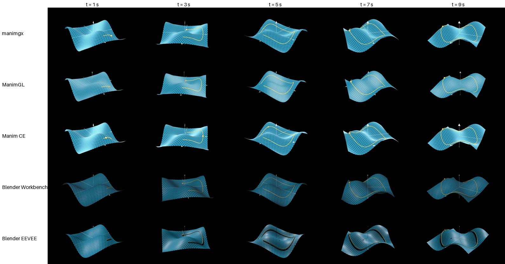
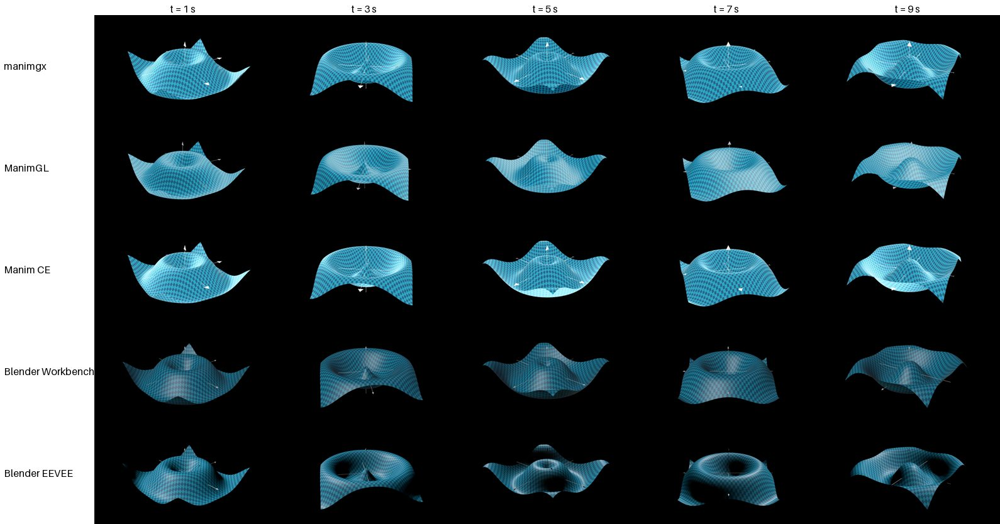
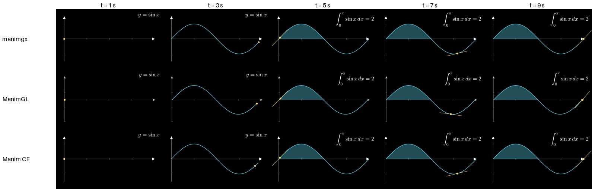

# Benchmarks

manimgx, [Manim Community Edition](https://www.manim.community),
[ManimGL](https://github.com/3b1b/manim) and [Blender](https://www.blender.org), rendering
the same scenes to the same videos: 1920 × 1080 at 60 frames per second, H.264 in an MP4.

<p align="center">
  <picture>
    <source media="(prefers-color-scheme: dark)" srcset="https://manimgx.academa.ai/images/benchmark-dark.svg">
    <source media="(prefers-color-scheme: light)" srcset="https://manimgx.academa.ai/images/benchmark-light.svg">
    
  </picture>
</p>

## Results

The median time from launch to a finished MP4, and how many times manimgx's it is, on a
MacBook Pro with an Apple M4 Pro (12 CPU cores, 16 GPU cores, 24 GB) under macOS 15.7, on
2026-09-29, at commit 8e95dd39:

| | orbit (3D) | morph (3D) | explainer (2D) |
| --- | ---: | ---: | ---: |
| **manimgx** 0.1.0 | **0.85 s** | **9.0 s** | **0.58 s** |
| ManimGL 1.7.2 | 6.2 s (7.3×) | 73 s (8.1×) | 6.1 s (11×) |
| Blender 5.2, Workbench | 18 s (22×) | 18 s (2.1×) | |
| Blender 5.2, EEVEE | 3 min 59 s (281×) | 4 min 14 s (28×) | |
| Manim CE 0.21.0 | 4 min 03 s (286×) | 11 min 42 s (78×) | 4.0 s (7.0×) |

- **Its videos are larger.** manimgx encodes with x264's ultrafast preset at CRF 18: the
  orbit scene is 71.7 MB, where the other tools write 3 to 6 MB. Encoding as Manim CE and
  ManimGL do, with the medium preset at CRF 23, manimgx renders it in 3.2 s instead of
  1.2 s (both measured in one session, on a busier machine than the table's), into 5.8 MB:
  still twice as fast as ManimGL, and six times as fast as Blender's Workbench.
- **The morph scene is its hardest.** A surface rebuilt every frame costs manimgx 15 ms a
  frame, most of it spent refining the new surface in Python; Blender moves its mesh's
  points in place.
- **Runs.** Manim CE's morph ran once (a run takes twelve minutes) and its orbit four
  times, Blender's EEVEE and ManimGL's morph three times, and everything else five times;
  `results.json` has every run, with its CPU time, peak memory and the load average it
  started at.

## The scenes

Each scene is written once per tool, in the tool's own idiom and as alike as the tools
allow: manimgx's are three of its timed benchmarks' workloads, in
[`tests/benchmarks/scenes/`](../../tests/benchmarks/scenes) (`<scene>.py`), so the scenes this
page times are the ones every change is checked against; the others are in [`scenes/`](scenes)
(`<scene>_<tool>.py`):

- **orbit** (3D, 10 s): a 48 × 48 checkerboard surface, z = sin(x) cos(y), on 3D axes; a
  curve drawn across it over six seconds with a ball riding its tip; and the camera circling
  the whole time, so every frame is new.
- **morph** (3D, 10 s): a 48 × 48 checkerboard ripple, z = 0.8 sin(2r − phase), rebuilt
  every frame, with the camera circling it. Manim's tools rebuild it with `always_redraw`;
  Blender moves its mesh's points from a frame-change handler with numpy.
- **explainer** (2D, 9.5 s): a sine curve drawn on axes with a dot riding it, the area under
  its first arch, `y = \sin x` turning into its integral, then a tangent line sliding along
  the curve. Blender has no math typesetting, so it renders the 3D scenes only.

The frames at 1, 3, 5, 7 and 9 seconds of each tool's video: the geometry, the camera and
the timing are the same; the shading is each renderer's own.







## How it was measured

- A run is the tool's own command (`manimgx render`, `manim render -qh`, `manimgl -w --hd`,
  `blender -b`), in a fresh process and a fresh folder, with the tool's caches empty (Manim
  CE's and ManimGL's LaTeX, manimgx's Typst layouts): an agent's first render of a new scene.
- Its time runs from launch to exit, when the MP4 is written. Its CPU time and peak memory
  are recorded too, in [`results.json`](results.json), with every run.
- Each contender renders each scene once to warm up (a run of more than two minutes counts
  instead), then the contenders take turns until each has five runs: three if a run takes
  over a minute, one if it takes over ten. The table shows the medians.
- Each video is checked for its length, then deleted.
- Each tool encodes with its own defaults: manimgx with x264's ultrafast preset at CRF 18
  (larger files, a faster encoder), Manim CE and ManimGL with libx264's medium preset at
  CRF 23, and Blender with its H.264 "medium quality" at the "good" speed.
- Blender renders with EEVEE, its default renderer, at its default 64 samples, and with
  Workbench, its fastest. ManimGL typesets with its minimal LaTeX template, `basic`.
- The machine was shared with other work while the runs were timed; each run records the
  load average it started at.

## Installing

| | Installs | Needs besides |
| --- | --- | --- |
| manimgx | 140 MB with its dependencies (`pip install manimgx`) | nothing |
| Manim CE | 250 MB with its dependencies | LaTeX for math (a TeX distribution: 0.4 GB for a basic one, several GB for a full one); Cairo and Pango on Linux |
| ManimGL | 350 MB with its dependencies | LaTeX, FFmpeg |
| Blender | a 0.9 GB application | |

## Running it

```sh
uv sync --group ce                             # manimgx, and Manim CE (the `ce` group)
uv venv --python 3.12 /tmp/manimgl             # ManimGL, in an environment of its own
uv pip install --python /tmp/manimgl manimgl==1.7.2 setuptools
uv run --frozen python scripts/benchmark/run.py --manimgl /tmp/manimgl --blender /path/to/blender
uv run --frozen python scripts/benchmark/chart.py # the README's chart, from results.json
```

`run.py --only orbit --tools manimgx,manimgl` runs a part of it. The numbers also stand in
the README: change them together.
